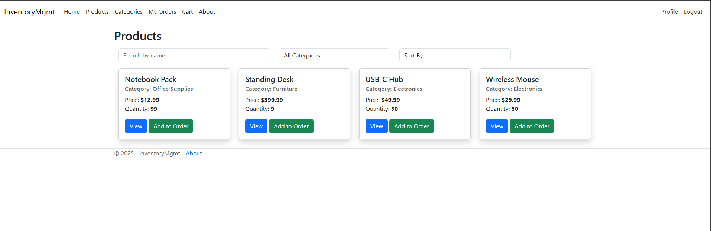
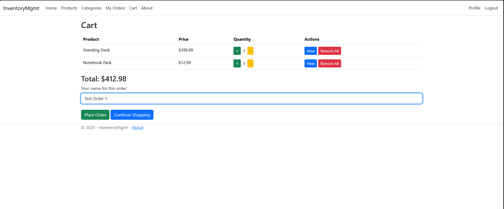
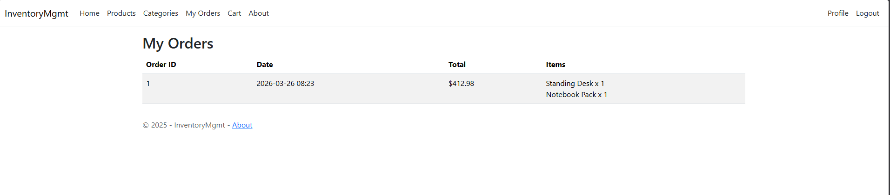

# Inventory Management System

A full-stack inventory management application built with ASP.NET Core MVC, Entity Framework Core, and PostgreSQL. Provides CRUD operations for managing inventory items through a server-rendered web interface.




---

## Tech Stack

- **Framework:** ASP.NET Core MVC
- **Language:** C#
- **ORM:** Entity Framework Core (Code-First with Migrations)
- **Database:** PostgreSQL
- **Frontend:** Razor Views, HTML/CSS
- **IDE:** JetBrains Rider

---

## Features

- View all products and or products by categories
- Add 1 or more products to cart
- Checkout/complete order and view order history
- Data persistence with PostgreSQL via EF Core
- Code-first database schema managed through migrations
- Server-rendered views using Razor syntax

---

## Getting Started

### Prerequisites

- [.NET SDK](https://dotnet.microsoft.com/download) (6.0+)
- [PostgreSQL](https://www.postgresql.org/download/)
- [EF Core CLI tools](https://learn.microsoft.com/en-us/ef/core/cli/dotnet) (`dotnet tool install --global dotnet-ef`)

### Setup

1. Clone the repo:
   ```bash
   git clone https://github.com/PierreEid/InventoryMgmt.git
   cd InventoryMgmt
   ```

2. Create a PostgreSQL database named `InventoryMgmt`.

3. Update the `DefaultConnection` string in `appsettings.json` to match your local PostgreSQL credentials.

4. Apply migrations:
   ```bash
   dotnet ef database update
   ```

5. Apply the following SQL script in PGAdmin to populate database:

INSERT INTO "Categories" ("Name", "Description") VALUES
('Electronics', 'Electronic devices and accessories'),
('Office Supplies', 'Pens, paper, and office essentials'),
('Furniture', 'Desks, chairs, and storage');

INSERT INTO "Products" ("ProductName", "CategoryId", "Price", "Quantity", "LowStockThreshold") VALUES
('Wireless Mouse', 1, 29.99, 50, 10),
('USB-C Hub', 1, 49.99, 30, 5),
('Notebook Pack', 2, 12.99, 100, 20),
('Standing Desk', 3, 399.99, 10, 2);

6. Run the application:
   ```bash
   dotnet run
   ```

7. Open your browser to the URL shown in the terminal (typically `https://localhost:5001` or `http://localhost:5000` or `http://localhost:5076`).

---

## Highlights & Takeaways

- First hands-on project using C# and the .NET ecosystem for web development
- Used EF Core's code-first approach to define the data model and generate the database schema entirely from C# classes
- Built server-rendered views with Razor, handling form submissions and model binding through MVC conventions
